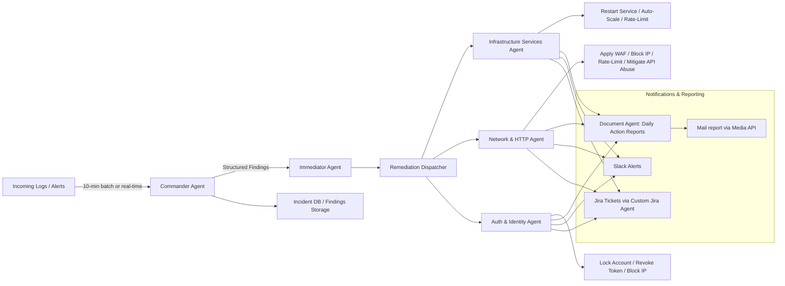

# ThreatPilot

**On-Demand Autonomous SOC Automation**

---

## 🚨 Overview

ThreatPilot is an **event-driven, agentic AI SOC system** that autonomously detects, analyzes, and remediates security incidents across **Identity, HTTP/API, and Infrastructure domains**.

It transforms SOC playbooks into **real-time executable intelligence**, dramatically reducing human response delays and operational overhead. ThreatPilot integrates log analysis, AI reasoning, and automated remediation for scalable SOC operations.

---

## 🔍 Problem Statement

* Security alerts arrive in seconds, but human responses take hours.
* Analysts manually triage and validate alerts, leading to **delays and human error**.
* Tool overload creates noise and reduces operational clarity.
* Teams are overwhelmed during attack spikes and idle during quiet hours.
* Current detection is standardized, but **response is inconsistent and slow**.

**ThreatPilot solves this by making response autonomous, auditable, and instantaneous.**

---

## ⚡ Solution: Autonomous, Event-Driven SOC

ThreatPilot operationalizes SOC playbooks into **autonomous agents** that activate only when alerts occur.

* Detect → Decide → Remediate → Audit → Report
* Fully event-driven to reduce idle compute and maximize attack responsiveness
* Structured incident outputs for **SOC audit, reporting, and compliance**

---

## 🧠 Architecture Overview



---

## 🧩 Domain-Specific Agents & Actions

| Domain                  | Remediation Agent             | Typical Actions                                                     |
| ----------------------- | ----------------------------- | ------------------------------------------------------------------- |
| Infrastructure Services | Infrastructure Services Agent | Restart service, auto-scale, rate-limit                             |
| Network & HTTP          | Network & HTTP Agent          | Apply WAF rules, block offending IP, mitigate API abuse, rate-limit |
| Auth & Identity         | Auth & Identity Agent         | Lock accounts, revoke tokens, block IPs                             |

---

## 🛠 Tech Stack

### Operational Stack

* **JavaScript (Node.js)** — Backend and agent orchestration
* **Express** — REST endpoints for agent communication
* **Grafana Loki** — Log aggregation and querying
* **Webhooks** — Slack, Jira, email notifications, Cloudflare

### OnDemand Stack

* Commander Agent — Log analysis & reasoning
* Immediator Agent — Normalization & orchestration
* Remediation Agents (Domain-specific) — Executes actions per domain
* Document Agent — Generates daily actionable reports enriched with detailed documentation, visual presentations, and media fetched via the Media API.
* Jira Agent — Creates tickets for human intervention
* Beautified Incident Reporter (Email / Slack / Jira)

---

## 🔁 Event-Driven Execution Model

* AI runs **only on alerts** (event-driven)
* Batch processing possible (e.g., every 10 minutes) for high throughput
* Historical storage of findings for **trend analysis, audit, and SOC review**
* Document Agent aggregates **daily actions** for SOC review and accountability

---

## 📄 Incident Flow

1. Logs pushed to Loki
2. Commander Agent queries logs or listens to alert events
3. Findings structured into JSON:

```json
{
  "execution_id": "exec-1768546131000-v2",
  "analyzed_time_window": {
    "from": 1768545531000,
    "to": 1768546131000
  },
  "metadata": {
    "commander_version": "2.1",
    "loki_api_status": "success",
    "services_discovered": ["auth-service", "notification-service", "payment-service", "api-gateway", "inventory-service", "order-service", "data-processor", "search-service", "user-service"],
    "total_logs_analyzed": 115,
    "fallback_mode": true
  },
  "findings": [
    {
      "finding_id": "exec-1768546131000-001",
      "domain": "identity",
      "classification": "brute_force",
      "severity": "high",
      "confidence": 0.97,
      "context": {
        "service": "auth-service"
      },
      "offender": {
        "type": "ip",
        "value"value": "203.0.113.50"
      },
      "metrics": {
        "event_count": 17,
        "unique_targets": 8,
        "success_count": 0,
        "failure_count": 17,
        "duration_sec": 300
      },
      "time_window": {
        "start": 1768545253000,
        "end": 1768545553000
      },
      "evidence": [
        "POST /auth/login 401 ip=203.0.113.50 user=dbadmin",
        "POST /auth/login 401 ip=203.0.113.50 user=root"
      ],
      "recommended_actions": ["block_ip:203.0.113.50", "enable_account_lockout"]
    },
  ]
}
```

4. Immediator Agent refines and prioritizes incidents
5. Remediation Dispatcher sends incident to appropriate **domain agent**
6. Domain agents execute actions and update:

   * **Document Agent** → daily report via Media API
   * **Slack alerts** for real-time notification
   * **Jira tickets** for incidents needing human review
7. Historical findings stored in **Incident DB**
8. SOC receives structured, audit-ready **daily report**

---

## 📊 Reporting & Audit

* Stores **historical incident findings** per domain
* Generates **daily actionable reports** via Document Agent
* Alerts sent to Slack for real-time monitoring
* Jira tickets created for human intervention where necessary
* Enables SOC teams to **cross-verify automated actions**
* Supports **trend analysis** for attack patterns
* Integrated a **Navigator** (ChatBot) that allows querying by SOC for clarifications, action mappings, and record lookups.
---

## 🏆 Why ThreatPilot

* Converts SOC playbooks into **instant, autonomous action**
* Reduces response times from **hours → seconds**
* Preserves human oversight while **removing bottlenecks**
* Fully scalable, auditable, and event-driven
* Daily action reports provide transparency and SOC accountability

**Alert → Analysis → Action → Report → Audit in seconds.**

---

## 📄 License

MIT
